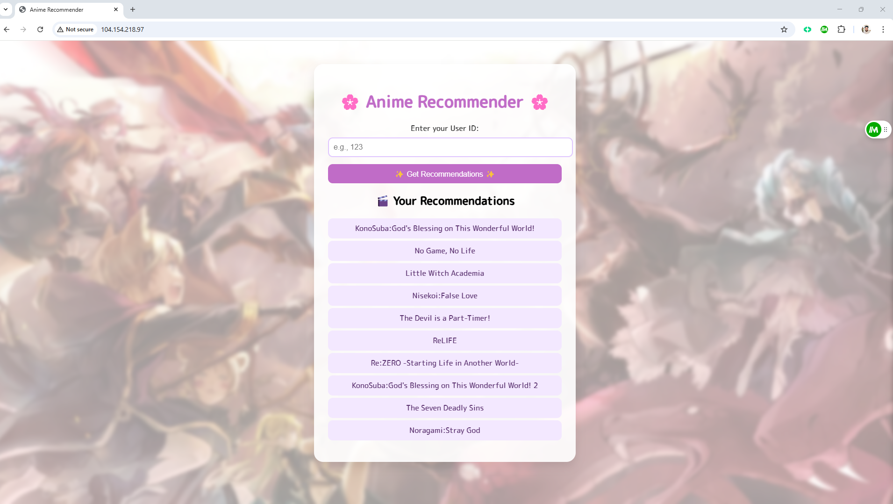

<h1 align="center">🎌 RekuAI — Anime Recommender System</h1> <p align="center"> <b>A Scalable, Hybrid AI Recommendation System for Anime Lovers</b><br> Powered by Machine Learning, DVC, Jenkins, Docker, and GKE </p> <p align="center"> <a href="#"></a> <a href="#"></a> <a href="#"></a> </p>

"Anime meets AI. Recommending your next obsession, one episode at a time."


🌟 Project Overview
RekuAI is a hybrid recommendation engine tailored for anime fans. It combines collaborative filtering and content-based filtering to deliver highly personalized anime suggestions. This system leverages a full MLOps pipeline — from fetching data stored on Google Cloud Storage (GCS), through model training and versioning with DVC, automated CI/CD using Jenkins DinD, all the way to deployment on Google Kubernetes Engine (GKE).

🚀 Built for scale, speed, and smarter recommendations.

🧠 Recommendation Engine
RekuAI uses a hybrid recommendation system:

Component	Technique	Description
🎯 Content-Based Filtering	TF-IDF + Cosine Similarity	Recommends based on anime genres, synopsis
🧑‍🤝‍🧑 Collaborative Filtering	Matrix Factorization / SVD	Learns user preferences from ratings
⚙️ Hybrid Engine	Weighted Blending	Combines both approaches for best results

## 📦 Key Features

- ✅ End-to-end ML lifecycle orchestration
- ✅ Data ingestion from Google Cloud Storage (GCS)
- ✅ CI/CD pipeline using Jenkins with Docker-in-Docker setup
- ✅ Model API built with FastAPI and containerized
- ✅ Cloud deployment with Kubernetes Engine Clusters


📁 Folder Structure

```bash
RekuAI/
├── src/                    # Core logic: recommenders, data pipelines
├── pipeline/               # ML pipeline orchestration
├── notebook/               # Jupyter notebooks for exploration
├── utils/                  # Helper scripts
├── templates/              # HTML templates (Flask UI)
├── static/css/             # Styling
├── .dvc/                   # DVC metadata
├── Jenkinsfile             # Jenkins pipeline config
├── Dockerfile              # Docker image build
├── deployment.yaml         # Kubernetes deployment spec
├── application.py          # FastAPI app entry point
├── .env                    # Environment variables
└── README.md               # You're here!
```

## 🚀 Getting Started

🔧 Prerequisites

Python 3.8+

Docker

DVC

Jenkins DinD setup

Access to GCP (GCS & GKE)

kubectl & gcloud CLI tools


## 🧪 Setup Instructions
bash
Copy
Edit
#### 1. Clone the repo
git clone https://github.com/yogeshkumarpilli/RekuAI.git && cd RekuAI

#### 2. Setup virtual environment
uv venv
.venv/bin/activate

#### 3. Install dependencies
uv sync
uv build

#### 4. Pull data from GCP via DVC
dvc pull

#### 5. Run the app locally
uv run application.py


## 📦 Dockerized App


bash

docker build -t rekuai-app .
docker run -p 5000:5000 rekuai-app


## ⚙️ CI/CD with Jenkins DinD

Jenkins is configured in Docker-in-Docker (DinD) mode to enable container builds.

Triggers on push to main branch.

Runs tests, rebuilds image, pushes to GCR, and deploys to GKE via kubectl.

📄 See Jenkinsfile for the full pipeline.

☁️ Google Cloud Deployment

GCS – Stores and serves anime datasets.

GKE – Hosts the recommendation engine as a scalable pod.

DockerHub/GCR – Stores container images.

Ingress – Exposes service endpoint for web app and API.

🌐 Live Endpoint: 

## 🖥️ User Interface
Built with FastAPI and served via Kubernetes.

Simple search & recommend UI

Returns a list of top anime recommendations for a given user or title.

## 🎯 Sample Output
```
json
{
  "input": "Naruto",
  "recommended": [
    "Bleach",
    "Fullmetal Alchemist",
    "One Piece",
    "Attack on Titan",
    "Demon Slayer"
  ]
}
```
👥 Contributors
Yogesh Kumar Pilli	

💌 Contact
📧 Email: pilliyogeshkumar@gmail.com
🌐 GitHub: @yogeshkumarpilli

